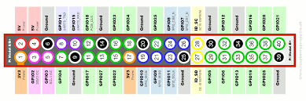

# BME280-Sensor
| Qty | Part # | Part Name        | Link | 
|-----|--------|------------------|------|
| 1  | RIP0W  | Raspberry Pi Zero |[Amazon](https://www.amazon.com/Raspberry-Bluetooth-Compatible-Connector-headers/dp/B0CG99MR5W/ref=sr_1_5?crid=314QK6UYSB3VM&dib=eyJ2IjoiMSJ9.KlhfpgHSKPo1ghamKtLQM4uGuGGrubUfmWB0qVyNRL6sE4nThDBydAUMC9Rp6HCipzrIZu-pA4TX-FMNUKEeVMpIQrTLuhbhkjA3frZmbMeEFJo4nVg27FiMIo0AlI9lWnewTXDkYaCsCbnshTQ2T-BidXcGjI1GbHSshPziV046WSAtBf8NX6AyTNuXR-_zS4crt4P7B6sK4yBKSBHam2vYvEheO8W_3CJyjBrsKf1tPjGHfOsY8kGibbtP-8ILMYuyCJiaw6mNKHF15WxzVyvqO8XAWgw9vIETewemlCc.IXcJzVJGmWvUfHEdpl5Ftu26vjN7awwmSMVj8oIalm8&dib_tag=se&keywords=Raspberry%2Bpi%2Bzero&qid=1743701882&s=electronics&sprefix=raspberry%2Bpi%2Bzero%2Celectronics%2C203&sr=1-5&th=1)       
| 1  | GY-BME280-3.3 | BME280 |[Amazon](https://www.amazon.com/SHILLEHTEK-PRE-SOLDERED-Atmospheric-Temperature-Microcontrollers/dp/B0CD4PQZGQ/ref=sr_1_3?crid=3HS9UQG0V0GPH&dib=eyJ2IjoiMSJ9.pJ2Urq-AmN76zViLMv7y4pFz1SfW0NsvveEqsQi6ZOyYdoGTVNn7suzJxLMV73sew9_s4Ds5Cd0mpAHqe7OQTUc2YnsEfQ8aKYwrXRPdMdDp335Pv6Pf3kwrlPFYoBugDwc6SkdcdboSrr2JWNnR9fZDblqeS7E6JZ19hWLevU_pWf2M0aYaT86BAyyz4Rcbm1QfIabDAzIPPr-sLZr2O32rY6nifMxQ8En39F53_bt-RMr8ErV2L3DftSypvyjunuRFSX2Fq1s0nKWQBHJpC1pSEbVNjBHkTx87UAOK8cs.VGFHv79FOiz8hmVwMra_bL9badygrJZWQLm3sCubrgo&dib_tag=se&keywords=pre+soldered+3.3v+bme280&qid=1743701754&s=electronics&sprefix=pre+sodered+3.3v+bme280%2Celectronics%2C127&sr=1-3-catcorr)     
| 4  | F-F Jumper Wire | 22   | [Amazon](https://www.amazon.com/bociloy-Dupont-Breadboard-Multi-Color-Connector/dp/B0D9NCD1Z3/ref=sr_1_5?crid=1J7F6YFM2GHLC&dib=eyJ2IjoiMSJ9.tjHxIQLJsk16_0YVtUGN6UHyUBKSnfs7IU4zkjBWId7Hk_j28yKTWV9mmPFZoTaaZWAnLq_sDOQ91JV_2O45DVl4rr3Lo_jsvNU7q5msuNQWYyim7KhYvVa-Q7pck_X8zNphLbTSxEr8oHSjWpI7Awsm7C-4_2cV1iIJYQnn4hKfIpmBQVFAxPIc8FNr3khi_BeFrly2xmA7e8bcVCJ_VRInGnanZaZGy-JTOlpconf2zh4RiAue6Iu5epbywykLzf6fYNpMmYXHrGj98QyFNCVtjwzqvcPdUpSGnx_9XYYFgQu3paXWToZKha0lbRRYVrE2QvN1YO_Et3JjSQ9WfCIcRME2NRtAFTNyPdSOykU.HbmkX0xOJvBCqzOU0uE8UKlMOyydG1nX9nZlETuXckg&dib_tag=se&keywords=female%2Bto%2Bfemale%2Bjumper%2Bwires&qid=1742940209&s=industrial&sprefix=female%2Bto%2Bfemalejumper%2Bwires%2Cindustrial%2C127&sr=1-5&th=1) 
| 1 | SDSDXXU-032G-GN4IN | 32GB Micro Sd Card |[Amazon](https://www.amazon.com/PNY-Elite-microSDHC-Memory-P-SDU32GU185GW-GE/dp/B07R8GVGN9/ref=sr_1_3?crid=3V34SI6IJCGSL&dib=eyJ2IjoiMSJ9.LKgWgu5d3qxyEv9_u8TsaYZdf7ccO_VKKOLvgr5EIHKbLWcLjYj2-umlWsvc-BHE0MjV02PmV5HIxKBEEcKudT_dD9QJkTQRfcnKZmh9Pqql_OZxNA0J-1x7KqcVzNL1mcBpdpUBlVmdkSMX_Z0JcHtt9If6RiP95NQqo5VPD73sOxWZYulEjFXw7oL3qc7W7_dPgWPYCfnttWjQpRHIAZEkiiKok1SZGr-w1-HtiPutCBSdeMnsZZ4NuRx7Img50FDSPT6jetJCMZbAFhJAQB8PFAy1PUPtDT_JkXWbZkU.KgNl9RQZGioCn-NEBl4WkqaslLPD5xcqWb3hWWOas1g&dib_tag=se&keywords=micro%2Bsd%2Bcard&qid=1743701421&refinements=p_n_feature_ten_browse-bin%3A6518304011&rnid=6518301011&s=electronics&sprefix=micro%2Bsd%2Bcard%2Caps%2C216&sr=1-3&th=1) 

## Steps
1. Assemble raspberry pi and sensor with jumper wires. Refrence youtube video for step-by-step directtions 

| Raspberry Pi Pin | | BME280 Pin | Connection |
|----------|----|---------------|-------------|
| 3.3V - Pin 1       | -> | VCC       | Power      |
| GND        | -> | GND       | Ground     |
|SDA (GPIO3) | -> | SDA | Serial Data Line |
| SCL (GPIO5) | -> | SCL | Serial Clock Line |
